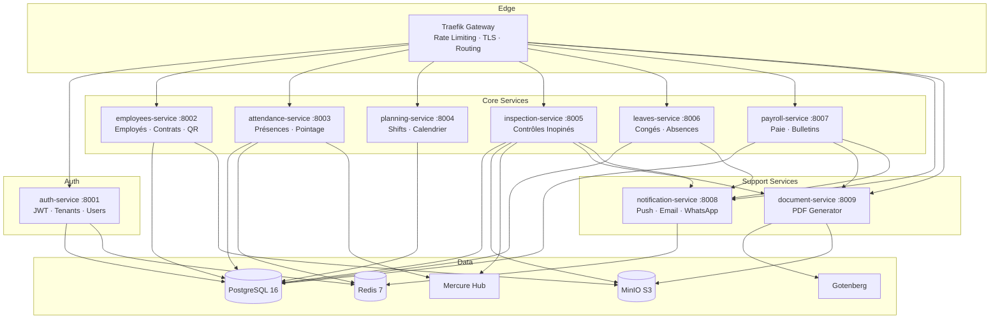
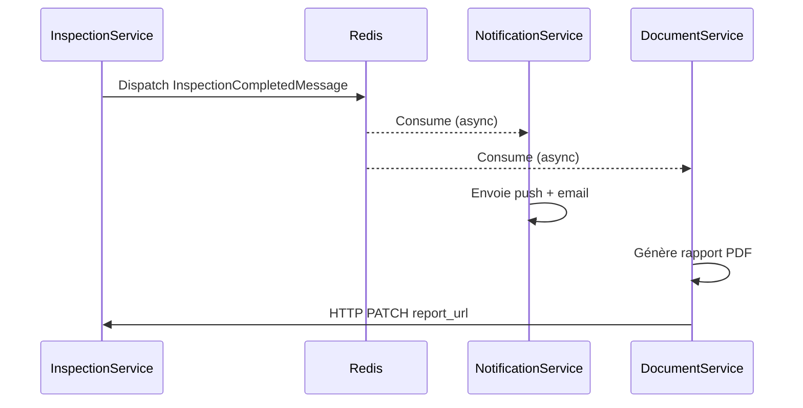
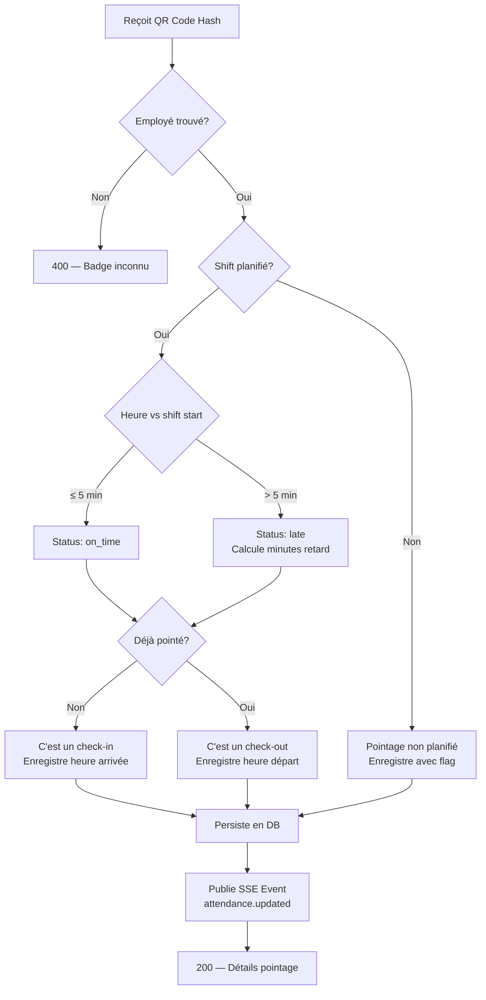
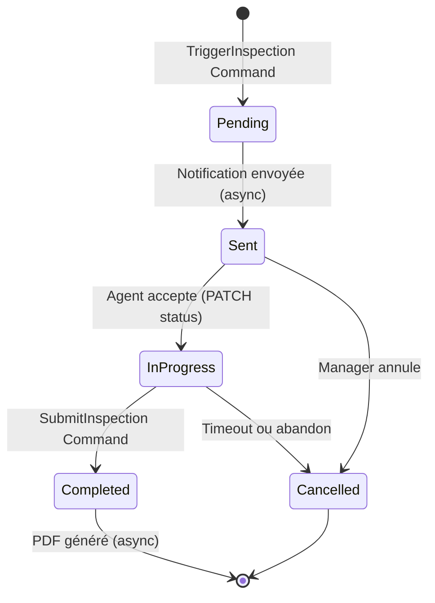

# Equencia — Cahier des Charges Backend
## Symfony 7 · API Platform 4 · Architecture Hexagonale + CQRS · PHP 8.4

**Produit :** Equencia  
**Périmètre :** Backend — API REST · Microservices · Infrastructure de données  
**Stack :** Symfony 7 · PHP 8.4 · PostgreSQL 16 · Redis 7 · Mercure · Gotenberg  
**Version :** 1.0 — Avril 2026  
**Statut :** Référence technique Backend

---

## Table des Matières

1. [Vue d'Ensemble Backend](#1-vue-densemble-backend)
2. [Architecture Hexagonale & CQRS](#2-architecture-hexagonale--cqrs)
3. [Structure des Microservices](#3-structure-des-microservices)
4. [Auth Service](#4-auth-service)
5. [Employees Service](#5-employees-service)
6. [Attendance Service](#6-attendance-service)
7. [Planning Service](#7-planning-service)
8. [Inspection Service](#8-inspection-service)
9. [Leaves Service](#9-leaves-service)
10. [Payroll Service](#10-payroll-service)
11. [Notification Service](#11-notification-service)
12. [Document Service](#12-document-service)
13. [Base de Données](#13-base-de-données)
14. [Sécurité & Multi-Tenancy](#14-sécurité--multi-tenancy)
15. [Temps Réel — Mercure](#15-temps-réel--mercure)
16. [Queue & Async — Messenger](#16-queue--async--messenger)
17. [Tests Backend](#17-tests-backend)
18. [Conventions de Code](#18-conventions-de-code)

---

## 1. Vue d'Ensemble Backend

### 1.1 Topologie des Services



### 1.2 Principes Techniques

- **Architecture hexagonale** sur chaque service : Domain / Application / Infrastructure / Interface
- **CQRS** : séparation stricte Commands (écriture) et Queries (lecture)
- **Symfony Messenger** : toutes les opérations lourdes en asynchrone (Redis transport)
- **Domain Events** : communication inter-services via événements
- **PHP 8.4 strict** : `declare(strict_types=1)` sur tous les fichiers, readonly properties, enums
- **Zéro commentaire** : code auto-documenté, README par dossier
- **Test-first** : PHPUnit + Foundry, couverture > 80% sur le domaine

### 1.3 Communication Inter-Services



**Pas de communication directe entre services** — tous les échanges passent par Redis (Messenger) ou HTTP REST. Chaque service est autonome et déployable indépendamment.

---

## 2. Architecture Hexagonale & CQRS

### 2.1 Couches Hexagonales

```
Service/
├── Domain/                     ← CŒUR — Zéro dépendance framework
│   ├── Entity/                 ← Entités riches avec logique métier
│   ├── ValueObject/            ← Objets valeur immuables
│   ├── Repository/             ← Interfaces (ports)
│   ├── Event/                  ← Domain Events
│   ├── Exception/              ← Exceptions métier
│   └── Service/                ← Domain Services
│
├── Application/                ← ORCHESTRATION — Use cases
│   ├── Command/                ← Write operations
│   │   ├── CreateEmployee/
│   │   │   ├── CreateEmployeeCommand.php
│   │   │   └── CreateEmployeeHandler.php
│   │   └── .../
│   ├── Query/                  ← Read operations
│   │   ├── GetEmployeeById/
│   │   │   ├── GetEmployeeByIdQuery.php
│   │   │   └── GetEmployeeByIdHandler.php
│   │   └── .../
│   ├── DTO/                    ← Data Transfer Objects
│   └── EventHandler/           ← Handlers domain events
│
├── Infrastructure/             ← ADAPTATEURS — Implémentations concrètes
│   ├── Persistence/            ← Repositories Doctrine
│   ├── Messenger/              ← Message handlers async
│   ├── External/               ← Clients API tiers
│   └── Storage/                ← S3/MinIO adapter
│
└── Interface/                  ← ENTRÉE — Controllers, Serializers
    ├── Api/                    ← API Platform Resources
    ├── Controller/             ← Controllers custom
    └── Serializer/             ← Normalizers
```

### 2.2 Exemple Complet — Création d'Employé

#### Domain Entity

```php
// Domain/Entity/Employee.php
declare(strict_types=1);

namespace App\Domain\Entity;

use App\Domain\ValueObject\EmployeeId;
use App\Domain\ValueObject\TenantId;
use App\Domain\ValueObject\QrCodeHash;
use App\Domain\ValueObject\ContractType;
use App\Domain\ValueObject\PayFrequency;
use App\Domain\Event\EmployeeCreated;

final class Employee
{
    private array $domainEvents = [];

    private function __construct(
        public readonly EmployeeId $id,
        public readonly TenantId $tenantId,
        private string $firstName,
        private string $lastName,
        private string $matricule,
        private string $position,
        private ContractType $contractType,
        private PayFrequency $payFrequency,
        private int $baseSalaryFcfa,
        private readonly QrCodeHash $qrCodeHash,
        private EmployeeStatus $status = EmployeeStatus::Trial,
    ) {}

    public static function create(
        TenantId $tenantId,
        string $firstName,
        string $lastName,
        string $position,
        ContractType $contractType,
        PayFrequency $payFrequency,
        int $baseSalaryFcfa,
    ): self {
        $employee = new self(
            id: EmployeeId::generate(),
            tenantId: $tenantId,
            firstName: $firstName,
            lastName: $lastName,
            matricule: self::generateMatricule($tenantId),
            position: $position,
            contractType: $contractType,
            payFrequency: $payFrequency,
            baseSalaryFcfa: $baseSalaryFcfa,
            qrCodeHash: QrCodeHash::generate(),
        );

        $employee->domainEvents[] = new EmployeeCreated($employee->id, $tenantId);

        return $employee;
    }

    public function activate(): void
    {
        $this->status = EmployeeStatus::Active;
    }

    public function archive(): void
    {
        if ($this->status === EmployeeStatus::Inactive) {
            throw new \DomainException('Employee is already archived.');
        }
        $this->status = EmployeeStatus::Inactive;
    }

    public function fullName(): string
    {
        return "{$this->firstName} {$this->lastName}";
    }

    public function pullDomainEvents(): array
    {
        $events = $this->domainEvents;
        $this->domainEvents = [];
        return $events;
    }

    private static function generateMatricule(TenantId $tenantId): string
    {
        return strtoupper(substr($tenantId->value, 0, 4)) . '-' . str_pad((string) random_int(1, 9999), 4, '0', STR_PAD_LEFT);
    }

    // Getters
    public function firstName(): string { return $this->firstName; }
    public function lastName(): string  { return $this->lastName; }
    public function status(): EmployeeStatus { return $this->status; }
    public function qrCodeHash(): QrCodeHash { return $this->qrCodeHash; }
    public function matricule(): string { return $this->matricule; }
    public function baseSalaryFcfa(): int { return $this->baseSalaryFcfa; }
}
```

#### Value Objects

```php
// Domain/ValueObject/QrCodeHash.php
declare(strict_types=1);

namespace App\Domain\ValueObject;

final readonly class QrCodeHash
{
    public function __construct(public readonly string $value) {}

    public static function generate(): self
    {
        return new self(hash('sha256', uniqid('', true) . random_bytes(32)));
    }

    public static function from(string $value): self
    {
        if (strlen($value) !== 64) {
            throw new \InvalidArgumentException('Invalid QR code hash format.');
        }
        return new self($value);
    }
}

// Domain/ValueObject/ContractType.php
enum ContractType: string
{
    case CDI       = 'CDI';
    case CDD       = 'CDD';
    case Stage     = 'Stage';
    case Journalier = 'Journalier';

    public function isFixed(): bool
    {
        return $this === self::CDD || $this === self::Stage;
    }

    public function requiresEndDate(): bool
    {
        return $this->isFixed();
    }
}
```

#### Command + Handler

```php
// Application/Command/CreateEmployee/CreateEmployeeCommand.php
declare(strict_types=1);

namespace App\Application\Command\CreateEmployee;

final readonly class CreateEmployeeCommand
{
    public function __construct(
        public readonly string $tenantId,
        public readonly string $firstName,
        public readonly string $lastName,
        public readonly string $position,
        public readonly string $contractType,
        public readonly string $payFrequency,
        public readonly int $baseSalaryFcfa,
        public readonly string $siteId,
        public readonly ?string $departmentId = null,
    ) {}
}

// Application/Command/CreateEmployee/CreateEmployeeHandler.php
declare(strict_types=1);

namespace App\Application\Command\CreateEmployee;

use App\Domain\Entity\Employee;
use App\Domain\Repository\EmployeeRepositoryInterface;
use App\Domain\Repository\SiteRepositoryInterface;
use App\Domain\ValueObject\TenantId;
use App\Domain\ValueObject\ContractType;
use App\Domain\ValueObject\PayFrequency;
use Symfony\Component\Messenger\Attribute\AsMessageHandler;

#[AsMessageHandler]
final class CreateEmployeeHandler
{
    public function __construct(
        private readonly EmployeeRepositoryInterface $employees,
        private readonly SiteRepositoryInterface $sites,
    ) {}

    public function __invoke(CreateEmployeeCommand $command): string
    {
        $tenantId = TenantId::from($command->tenantId);

        $site = $this->sites->findByIdAndTenant($command->siteId, $tenantId)
            ?? throw new \DomainException("Site not found: {$command->siteId}");

        $employee = Employee::create(
            tenantId: $tenantId,
            firstName: $command->firstName,
            lastName: $command->lastName,
            position: $command->position,
            contractType: ContractType::from($command->contractType),
            payFrequency: PayFrequency::from($command->payFrequency),
            baseSalaryFcfa: $command->baseSalaryFcfa,
        );

        $employee->assignToSite($site);

        $this->employees->save($employee);

        return $employee->id->value;
    }
}
```

#### Repository Interface + Implementation

```php
// Domain/Repository/EmployeeRepositoryInterface.php
declare(strict_types=1);

namespace App\Domain\Repository;

use App\Domain\Entity\Employee;
use App\Domain\ValueObject\EmployeeId;
use App\Domain\ValueObject\TenantId;

interface EmployeeRepositoryInterface
{
    public function save(Employee $employee): void;
    public function findById(EmployeeId $id, TenantId $tenantId): ?Employee;
    public function findByQrHash(string $hash, TenantId $tenantId): ?Employee;
    public function findAll(TenantId $tenantId, EmployeeFilters $filters): EmployeePage;
    public function delete(EmployeeId $id, TenantId $tenantId): void;
}

// Infrastructure/Persistence/DoctrineEmployeeRepository.php
declare(strict_types=1);

namespace App\Infrastructure\Persistence;

use App\Domain\Entity\Employee;
use App\Domain\Repository\EmployeeRepositoryInterface;
use App\Domain\ValueObject\EmployeeId;
use App\Domain\ValueObject\TenantId;
use Doctrine\Bundle\DoctrineBundle\Repository\ServiceEntityRepository;

final class DoctrineEmployeeRepository
    extends ServiceEntityRepository
    implements EmployeeRepositoryInterface
{
    public function save(Employee $employee): void
    {
        $this->getEntityManager()->persist($employee);
        $this->getEntityManager()->flush();
    }

    public function findById(EmployeeId $id, TenantId $tenantId): ?Employee
    {
        return $this->createQueryBuilder('e')
            ->where('e.id = :id')
            ->andWhere('e.tenantId = :tenantId')
            ->setParameter('id', $id->value)
            ->setParameter('tenantId', $tenantId->value)
            ->getQuery()
            ->getOneOrNullResult();
    }

    public function findByQrHash(string $hash, TenantId $tenantId): ?Employee
    {
        return $this->createQueryBuilder('e')
            ->where('e.qrCodeHash = :hash')
            ->andWhere('e.tenantId = :tenantId')
            ->andWhere('e.status != :archived')
            ->setParameter('hash', $hash)
            ->setParameter('tenantId', $tenantId->value)
            ->setParameter('archived', EmployeeStatus::Inactive->value)
            ->getQuery()
            ->getOneOrNullResult();
    }

    public function findAll(TenantId $tenantId, EmployeeFilters $filters): EmployeePage
    {
        $qb = $this->createQueryBuilder('e')
            ->where('e.tenantId = :tenantId')
            ->setParameter('tenantId', $tenantId->value);

        if ($filters->search) {
            $qb->andWhere('(e.firstName LIKE :s OR e.lastName LIKE :s OR e.matricule LIKE :s)')
               ->setParameter('s', "%{$filters->search}%");
        }

        if ($filters->siteId) {
            $qb->andWhere('e.siteId = :siteId')->setParameter('siteId', $filters->siteId);
        }

        if ($filters->status) {
            $qb->andWhere('e.status = :status')->setParameter('status', $filters->status);
        }

        $total = (clone $qb)->select('COUNT(e.id)')->getQuery()->getSingleScalarResult();

        $items = $qb
            ->orderBy('e.lastName', 'ASC')
            ->setFirstResult(($filters->page - 1) * $filters->perPage)
            ->setMaxResults($filters->perPage)
            ->getQuery()
            ->getResult();

        return new EmployeePage($items, (int) $total, $filters->page, $filters->perPage);
    }
}
```

---

## 3. Structure des Microservices

### 3.1 Fichiers Communs à Tous les Services

```
service/
├── src/
│   ├── Domain/
│   │   ├── Entity/
│   │   ├── ValueObject/
│   │   │   └── TenantId.php        ← Partagé (copié dans chaque service)
│   │   ├── Repository/
│   │   ├── Event/
│   │   ├── Exception/
│   │   └── Service/
│   ├── Application/
│   │   ├── Command/
│   │   ├── Query/
│   │   ├── DTO/
│   │   └── EventHandler/
│   ├── Infrastructure/
│   │   ├── Persistence/
│   │   ├── Messenger/
│   │   ├── External/
│   │   └── Storage/
│   └── Interface/
│       ├── Api/
│       ├── Controller/
│       └── Serializer/
├── config/
│   ├── packages/
│   │   ├── api_platform.yaml
│   │   ├── doctrine.yaml
│   │   ├── messenger.yaml
│   │   ├── mercure.yaml
│   │   └── security.yaml
│   └── routes/
│       └── api_platform.yaml
├── migrations/
├── tests/
│   ├── Unit/
│   │   ├── Domain/
│   │   └── Application/
│   ├── Integration/
│   │   └── Infrastructure/
│   └── Fixtures/
├── .env
├── composer.json
├── Dockerfile
└── README.md
```

### 3.2 Configuration Commune Symfony

```yaml
# config/packages/security.yaml
security:
    enable_authenticator_manager: true

    password_hashers:
        App\Domain\Entity\User:
            algorithm: bcrypt
            cost: 12

    providers:
        jwt_provider:
            id: App\Infrastructure\Security\JwtUserProvider

    firewalls:
        login:
            pattern: ^/api/auth/login
            stateless: true
            json_login:
                check_path: /api/auth/login
                success_handler: lexik_jwt_authentication.handler.authentication_success
                failure_handler: lexik_jwt_authentication.handler.authentication_failure

        api:
            pattern: ^/api
            stateless: true
            jwt: ~

    access_control:
        - { path: ^/api/auth/login,    roles: PUBLIC_ACCESS }
        - { path: ^/api/auth/register, roles: PUBLIC_ACCESS }
        - { path: ^/api,               roles: IS_AUTHENTICATED_FULLY }
```

```yaml
# config/packages/messenger.yaml
framework:
    messenger:
        transports:
            async:
                dsn: '%env(REDIS_URL)%'
                options:
                    stream: equencia_messages
                    group: equencia_workers
                retry_strategy:
                    max_retries: 3
                    delay: 1000
                    multiplier: 2

        routing:
            App\Application\Command\*: async
            App\Infrastructure\Messenger\Message\*: async
```

```yaml
# config/packages/doctrine.yaml
doctrine:
    dbal:
        url: '%env(resolve:DATABASE_URL)%'
        types:
            uuid: Symfony\Bridge\Doctrine\Types\UuidType
    orm:
        auto_generate_proxy_classes: true
        naming_strategy: doctrine.orm.naming_strategy.underscore_number_aware
        auto_mapping: true
        mappings:
            App:
                type: attribute
                dir: '%kernel.project_dir%/src/Domain/Entity'
                prefix: 'App\Domain\Entity'
```

### 3.3 Middleware Multi-Tenant

```php
// Infrastructure/EventListener/TenantMiddleware.php
declare(strict_types=1);

namespace App\Infrastructure\EventListener;

use App\Domain\ValueObject\TenantId;
use App\Infrastructure\Security\TenantContext;
use Symfony\Component\HttpKernel\Event\RequestEvent;
use Lexik\Bundle\JWTAuthenticationBundle\Services\JWTTokenManagerInterface;

final class TenantMiddleware
{
    public function __construct(
        private readonly TenantContext $tenantContext,
        private readonly JWTTokenManagerInterface $jwtManager,
    ) {}

    public function onKernelRequest(RequestEvent $event): void
    {
        $request = $event->getRequest();
        $authHeader = $request->headers->get('Authorization', '');

        if (!str_starts_with($authHeader, 'Bearer ')) {
            return;
        }

        $token = substr($authHeader, 7);
        $payload = $this->jwtManager->parse($token);

        if (!isset($payload['tenant_id'])) {
            return;
        }

        $this->tenantContext->set(TenantId::from($payload['tenant_id']));
    }
}

// Infrastructure/Security/TenantContext.php
declare(strict_types=1);

namespace App\Infrastructure\Security;

use App\Domain\ValueObject\TenantId;

final class TenantContext
{
    private ?TenantId $currentTenantId = null;

    public function set(TenantId $tenantId): void
    {
        $this->currentTenantId = $tenantId;
    }

    public function get(): TenantId
    {
        return $this->currentTenantId
            ?? throw new \LogicException('No tenant context available.');
    }

    public function has(): bool
    {
        return $this->currentTenantId !== null;
    }
}
```

---

## 4. Auth Service

### 4.1 Responsabilités

- Gestion des tenants (entreprises)
- Gestion des utilisateurs et rôles
- Émission et révocation des JWT
- Plans d'abonnement et limites

### 4.2 Entités Principales

```php
// Domain/Entity/Tenant.php
#[ORM\Entity]
#[ORM\Table(name: 'tenants')]
final class Tenant
{
    #[ORM\Id, ORM\Column(type: 'uuid')]
    public readonly string $id;

    #[ORM\Column(length: 100)]
    private string $name;

    #[ORM\Column(length: 50, unique: true)]
    private string $slug;

    #[ORM\Column(enumType: TenantPlan::class)]
    private TenantPlan $plan;

    #[ORM\Column(enumType: TenantStatus::class)]
    private TenantStatus $status;

    #[ORM\Column(type: 'integer')]
    private int $employeeLimit;

    #[ORM\Column(type: 'datetimetz_immutable', nullable: true)]
    private ?\DateTimeImmutable $trialEndsAt;
}

enum TenantPlan: string
{
    case Starter    = 'starter';
    case Business   = 'business';
    case Pro        = 'pro';
    case Enterprise = 'enterprise';

    public function employeeLimit(): int
    {
        return match($this) {
            self::Starter    => 10,
            self::Business   => 50,
            self::Pro        => 200,
            self::Enterprise => PHP_INT_MAX,
        };
    }

    public function monthlyPriceFcfa(): int
    {
        return match($this) {
            self::Starter    => 15000,
            self::Business   => 45000,
            self::Pro        => 120000,
            self::Enterprise => 0,
        };
    }
}

// Domain/Entity/User.php
#[ORM\Entity]
#[ORM\Table(name: 'users')]
final class User implements UserInterface
{
    #[ORM\Id, ORM\Column(type: 'uuid')]
    public readonly string $id;

    #[ORM\Column(type: 'uuid', nullable: false)]
    public readonly string $tenantId;

    #[ORM\Column(length: 180, unique: true)]
    private string $email;

    #[ORM\Column]
    private string $passwordHash;

    #[ORM\Column(enumType: UserRole::class)]
    private UserRole $role;

    #[ORM\Column(length: 50)]
    private string $firstName;

    #[ORM\Column(length: 50)]
    private string $lastName;

    #[ORM\Column(length: 20, nullable: true)]
    private ?string $phoneWhatsapp;

    #[ORM\Column(type: 'datetimetz_immutable', nullable: true)]
    private ?\DateTimeImmutable $lastLoginAt;
}

enum UserRole: string
{
    case SuperAdmin = 'super_admin';
    case Admin      = 'admin';
    case Manager    = 'manager';
    case HR         = 'hr';
    case Agent      = 'agent';
    case Reader     = 'reader';
}
```

### 4.3 Endpoints Auth

```php
// Interface/Controller/AuthController.php
#[Route('/api/auth', name: 'auth_')]
final class AuthController extends AbstractController
{
    #[Route('/register', name: 'register', methods: ['POST'])]
    public function register(
        #[MapRequestPayload] RegisterRequest $request,
        CommandBusInterface $bus,
    ): JsonResponse {
        $tenantId = $bus->dispatch(new RegisterTenantCommand(
            companyName: $request->companyName,
            sector: $request->sector,
            adminEmail: $request->email,
            adminPassword: $request->password,
            adminFirstName: $request->firstName,
            adminLastName: $request->lastName,
        ));

        return $this->json(['tenant_id' => $tenantId], Response::HTTP_CREATED);
    }

    #[Route('/me', name: 'me', methods: ['GET'])]
    #[IsGranted('IS_AUTHENTICATED_FULLY')]
    public function me(Security $security): JsonResponse
    {
        return $this->json($security->getUser());
    }

    #[Route('/refresh', name: 'refresh', methods: ['POST'])]
    public function refresh(
        Request $request,
        RefreshTokenService $service,
    ): JsonResponse {
        $refreshToken = $request->request->get('refresh_token')
            ?? throw new BadRequestHttpException('Missing refresh_token');

        return $this->json($service->refresh($refreshToken));
    }
}
```

### 4.4 JWT Configuration

```yaml
# config/packages/lexik_jwt_authentication.yaml
lexik_jwt_authentication:
    secret_key: '%kernel.project_dir%/config/jwt/private.pem'
    public_key: '%kernel.project_dir%/config/jwt/public.pem'
    pass_phrase: '%env(JWT_PASSPHRASE)%'
    token_ttl: 900   # 15 minutes

    token_extractors:
        authorization_header:
            enabled: true
            prefix: Bearer
            name: Authorization

    set_cookies:
        REFRESH_TOKEN:
            lifetime: 604800  # 7 jours
            samesite: strict
            httpOnly: true
            secure: true
            path: /api/auth/refresh
```

---

## 5. Employees Service

### 5.1 API Platform Resource

```php
// Interface/Api/EmployeeResource.php
declare(strict_types=1);

namespace App\Interface\Api;

use ApiPlatform\Metadata\ApiResource;
use ApiPlatform\Metadata\Get;
use ApiPlatform\Metadata\GetCollection;
use ApiPlatform\Metadata\Post;
use ApiPlatform\Metadata\Patch;
use ApiPlatform\Metadata\Delete;
use ApiPlatform\Metadata\ApiFilter;
use ApiPlatform\Doctrine\Orm\Filter\SearchFilter;
use ApiPlatform\Doctrine\Orm\Filter\OrderFilter;

#[ApiResource(
    operations: [
        new GetCollection(
            uriTemplate: '/employees',
            security: "is_granted('employee:list')",
            filters: ['employee.search_filter', 'employee.order_filter'],
            paginationMaximumItemsPerPage: 50,
        ),
        new Post(
            uriTemplate: '/employees',
            security: "is_granted('employee:create')",
            processor: CreateEmployeeProcessor::class,
        ),
        new Get(
            uriTemplate: '/employees/{id}',
            security: "is_granted('employee:view', object)",
        ),
        new Patch(
            uriTemplate: '/employees/{id}',
            security: "is_granted('employee:edit', object)",
            processor: UpdateEmployeeProcessor::class,
        ),
        new Delete(
            uriTemplate: '/employees/{id}',
            security: "is_granted('employee:archive')",
            processor: ArchiveEmployeeProcessor::class,
        ),
        new Post(
            uriTemplate: '/employees/{id}/badge/generate',
            security: "is_granted('employee:edit', object)",
            processor: GenerateBadgeProcessor::class,
        ),
    ],
    normalizationContext: ['groups' => ['employee:read']],
    denormalizationContext: ['groups' => ['employee:write']],
)]
#[ApiFilter(SearchFilter::class, properties: [
    'firstName' => 'partial',
    'lastName'  => 'partial',
    'matricule' => 'partial',
    'siteId'    => 'exact',
    'status'    => 'exact',
    'contractType' => 'exact',
])]
class EmployeeResource { /* ... */ }
```

### 5.2 Génération QR Code Badge

```php
// Application/Command/GenerateBadge/GenerateBadgeHandler.php
declare(strict_types=1);

namespace App\Application\Command\GenerateBadge;

use App\Domain\Repository\EmployeeRepositoryInterface;
use App\Domain\ValueObject\EmployeeId;
use App\Domain\ValueObject\TenantId;
use App\Infrastructure\PDF\BadgePDFGenerator;
use App\Infrastructure\Storage\StorageInterface;
use Symfony\Component\Messenger\Attribute\AsMessageHandler;

#[AsMessageHandler]
final class GenerateBadgeHandler
{
    public function __construct(
        private readonly EmployeeRepositoryInterface $employees,
        private readonly BadgePDFGenerator $pdfGenerator,
        private readonly StorageInterface $storage,
    ) {}

    public function __invoke(GenerateBadgeCommand $command): string
    {
        $employee = $this->employees->findById(
            EmployeeId::from($command->employeeId),
            TenantId::from($command->tenantId),
        ) ?? throw new \DomainException("Employee not found.");

        $qrCodeSvg = $this->generateQrSvg($employee->qrCodeHash()->value);
        $pdf = $this->pdfGenerator->generate($employee, $qrCodeSvg);

        $path = "badges/{$command->tenantId}/{$command->employeeId}.pdf";
        $url = $this->storage->put($path, $pdf, 'application/pdf');

        $this->employees->updateBadgeUrl($employee->id, $url);

        return $url;
    }

    private function generateQrSvg(string $hash): string
    {
        // Utilise endroid/qr-code
        $qrCode = QrCode::create($hash)
            ->setSize(300)
            ->setErrorCorrectionLevel(ErrorCorrectionLevel::High);

        return (new SvgWriter())->write($qrCode)->getString();
    }
}
```

---

## 6. Attendance Service

### 6.1 Logique de Pointage



### 6.2 Handler Pointage

```php
// Application/Command/RecordAttendance/RecordAttendanceHandler.php
declare(strict_types=1);

namespace App\Application\Command\RecordAttendance;

use App\Domain\Entity\Attendance;
use App\Domain\Repository\AttendanceRepositoryInterface;
use App\Domain\Repository\EmployeeRepositoryInterface;
use App\Domain\Repository\ShiftRepositoryInterface;
use App\Domain\ValueObject\TenantId;
use App\Infrastructure\Realtime\MercurePublisher;
use Symfony\Component\Messenger\Attribute\AsMessageHandler;

#[AsMessageHandler]
final class RecordAttendanceHandler
{
    public function __construct(
        private readonly EmployeeRepositoryInterface $employees,
        private readonly AttendanceRepositoryInterface $attendances,
        private readonly ShiftRepositoryInterface $shifts,
        private readonly MercurePublisher $mercure,
    ) {}

    public function __invoke(RecordAttendanceCommand $command): AttendanceResult
    {
        $tenantId = TenantId::from($command->tenantId);

        $employee = $this->employees->findByQrHash($command->qrHash, $tenantId)
            ?? throw new BadgeNotFoundException("QR code not recognized.");

        $now = new \DateTimeImmutable();
        $shift = $this->shifts->findActiveShiftForEmployee($employee->id, $tenantId, $now);

        // Vérifie si déjà pointé aujourd'hui (check-in sans check-out = check-out)
        $existing = $this->attendances->findTodayOpenRecord($employee->id, $tenantId);

        if ($existing !== null) {
            $existing->recordCheckOut($now);
            $this->attendances->save($existing);
            $this->mercure->publish("attendance/{$command->tenantId}", [
                'type' => 'attendance.checked_out',
                'employee' => $employee->id->value,
                'time' => $now->format('H:i:s'),
            ]);
            return AttendanceResult::checkOut($existing, $employee);
        }

        $lateMinutes = 0;
        $status = AttendanceStatus::OnTime;

        if ($shift !== null) {
            $diff = ($now->getTimestamp() - $shift->startTime()->getTimestamp()) / 60;
            if ($diff > 5) {
                $status = AttendanceStatus::Late;
                $lateMinutes = (int) $diff;
            }
        } else {
            $status = AttendanceStatus::Unplanned;
        }

        $attendance = Attendance::create(
            tenantId: $tenantId,
            employeeId: $employee->id,
            shiftId: $shift?->id,
            checkedInAt: $now,
            method: ScanMethod::from($command->method),
            status: $status,
            lateMinutes: $lateMinutes,
            gpsLat: $command->gpsLat,
            gpsLng: $command->gpsLng,
        );

        $this->attendances->save($attendance);

        $this->mercure->publish("attendance/{$command->tenantId}", [
            'type'     => 'attendance.checked_in',
            'employee' => ['id' => $employee->id->value, 'name' => $employee->fullName()],
            'status'   => $status->value,
            'time'     => $now->format('H:i:s'),
            'late'     => $lateMinutes,
        ]);

        return AttendanceResult::checkIn($attendance, $employee);
    }
}
```

### 6.3 Rapport Mensuel

```php
// Application/Query/GetMonthlyReport/GetMonthlyReportHandler.php
declare(strict_types=1);

namespace App\Application\Query\GetMonthlyReport;

use Symfony\Component\Messenger\Attribute\AsMessageHandler;

#[AsMessageHandler]
final class GetMonthlyReportHandler
{
    public function __construct(
        private readonly AttendanceRepositoryInterface $attendances,
        private readonly EmployeeRepositoryInterface $employees,
        private readonly ShiftRepositoryInterface $shifts,
    ) {}

    public function __invoke(GetMonthlyReportQuery $query): MonthlyReportDTO
    {
        $tenantId = TenantId::from($query->tenantId);
        $period = YearMonth::of($query->year, $query->month);

        $employees = $this->employees->findAllActive($tenantId);
        $rows = [];

        foreach ($employees as $employee) {
            $attendances = $this->attendances->findByEmployeeAndPeriod(
                $employee->id, $tenantId, $period
            );

            $rows[] = new EmployeeMonthlyRow(
                employee: $employee,
                daysWorked: count(array_filter($attendances, fn($a) => $a->isPresent())),
                daysAbsent: $this->shifts->countWorkingDays($period) - count($attendances),
                lateCount: count(array_filter($attendances, fn($a) => $a->isLate())),
                totalLateMinutes: array_sum(array_map(fn($a) => $a->lateMinutes(), $attendances)),
                overtimeHours: $this->calculateOvertime($attendances),
            );
        }

        return new MonthlyReportDTO($period, $rows);
    }
}
```

---

## 7. Planning Service

### 7.1 Logique Détection Conflits

```php
// Domain/Service/ConflictDetector.php
declare(strict_types=1);

namespace App\Domain\Service;

use App\Domain\Entity\Shift;
use App\Domain\Repository\ShiftRepositoryInterface;

final class ConflictDetector
{
    public function __construct(
        private readonly ShiftRepositoryInterface $shifts,
    ) {}

    public function detect(Shift $newShift): ShiftConflict|null
    {
        $overlapping = $this->shifts->findOverlapping(
            employeeId: $newShift->employeeId(),
            tenantId: $newShift->tenantId(),
            date: $newShift->shiftDate(),
            startTime: $newShift->startTime(),
            endTime: $newShift->endTime(),
            excludeId: $newShift->id ?? null,
        );

        if ($overlapping === null) {
            return null;
        }

        return new ShiftConflict(
            existingShift: $overlapping,
            conflictType: ConflictType::Overlap,
            message: "L'employé a déjà un shift qui se chevauche ce créneau."
        );
    }

    public function detectSiteUnderstaffing(
        string $siteId,
        TenantId $tenantId,
        \DateTimeImmutable $date,
    ): UnderstaffingWarning|null {
        $planned = $this->shifts->countPlanned($siteId, $tenantId, $date);
        $required = $this->shifts->getRequiredStaff($siteId, $tenantId, $date);

        if ($required === 0 || ($planned / $required) >= 0.8) {
            return null;
        }

        return new UnderstaffingWarning(
            siteId: $siteId,
            date: $date,
            planned: $planned,
            required: $required,
            ratio: $planned / $required,
        );
    }
}
```

---

## 8. Inspection Service

### 8.1 Workflow Complet



### 8.2 Trigger + Message Async

```php
// Application/Command/TriggerInspection/TriggerInspectionHandler.php
declare(strict_types=1);

namespace App\Application\Command\TriggerInspection;

use App\Domain\Entity\Inspection;
use App\Domain\Repository\InspectionRepositoryInterface;
use App\Domain\Repository\EmployeeRepositoryInterface;
use App\Infrastructure\Messenger\Message\SendInspectionNotificationMessage;
use App\Infrastructure\Realtime\MercurePublisher;
use Symfony\Component\Messenger\Attribute\AsMessageHandler;
use Symfony\Component\Messenger\MessageBusInterface;

#[AsMessageHandler]
final class TriggerInspectionHandler
{
    public function __construct(
        private readonly InspectionRepositoryInterface $inspections,
        private readonly EmployeeRepositoryInterface $employees,
        private readonly MessageBusInterface $bus,
        private readonly MercurePublisher $mercure,
    ) {}

    public function __invoke(TriggerInspectionCommand $command): string
    {
        $tenantId = TenantId::from($command->tenantId);

        $employee = $this->employees->findById(
            EmployeeId::from($command->employeeId),
            $tenantId,
        ) ?? throw new \DomainException('Employee not found.');

        $inspection = Inspection::create(
            tenantId: $tenantId,
            employeeId: $employee->id,
            triggeredBy: UserId::from($command->triggeredByUserId),
            agentId: UserId::from($command->agentId),
            triggerType: TriggerType::from($command->triggerType),
            isUrgent: $command->isUrgent,
            agentNotes: $command->agentNotes,
        );

        $this->inspections->save($inspection);

        // Notification async (ne bloque pas la réponse HTTP)
        $this->bus->dispatch(new SendInspectionNotificationMessage(
            inspectionId: $inspection->id->value,
            agentId: $command->agentId,
            isUrgent: $command->isUrgent,
        ));

        // SSE temps réel vers le dashboard
        $this->mercure->publish("inspection/{$command->tenantId}", [
            'type'          => 'inspection.created',
            'inspection_id' => $inspection->id->value,
            'employee'      => $employee->fullName(),
            'status'        => InspectionStatus::Pending->value,
        ]);

        return $inspection->id->value;
    }
}
```

### 8.3 Soumission Résultat + Génération PDF

```php
// Application/Command/SubmitInspection/SubmitInspectionHandler.php
#[AsMessageHandler]
final class SubmitInspectionHandler
{
    public function __construct(
        private readonly InspectionRepositoryInterface $inspections,
        private readonly StorageInterface $storage,
        private readonly MessageBusInterface $bus,
        private readonly MercurePublisher $mercure,
    ) {}

    public function __invoke(SubmitInspectionCommand $command): void
    {
        $inspection = $this->inspections->findById(
            InspectionId::from($command->inspectionId),
            TenantId::from($command->tenantId),
        ) ?? throw new \DomainException('Inspection not found.');

        if (!$inspection->isInProgress()) {
            throw new \DomainException('Inspection is not in progress.');
        }

        // Upload photo vers MinIO
        $photoPath = "inspections/{$command->tenantId}/{$command->inspectionId}/photo.jpg";
        $photoUrl = $this->storage->put($photoPath, $command->photoData, 'image/jpeg');

        $inspection->complete(
            result: InspectionResult::from($command->result),
            photoUrl: $photoUrl,
            gpsLat: $command->gpsLat,
            gpsLng: $command->gpsLng,
            distanceToSiteMeters: $command->distanceMeters,
            badgeScanMethod: ScanMethod::from($command->scanMethod),
            notes: $command->notes,
        );

        $this->inspections->save($inspection);

        // Génère le rapport PDF de manière asynchrone
        $this->bus->dispatch(new GenerateInspectionPDFMessage(
            inspectionId: $inspection->id->value,
            tenantId: $command->tenantId,
        ));

        // SSE temps réel
        $this->mercure->publish("inspection/{$command->tenantId}", [
            'type'          => 'inspection.completed',
            'inspection_id' => $inspection->id->value,
            'result'        => $command->result,
        ]);
    }
}
```

---

## 9. Leaves Service

### 9.1 Workflow Approbation

```php
// Application/Command/ProcessLeaveRequest/ProcessLeaveRequestHandler.php
declare(strict_types=1);

#[AsMessageHandler]
final class ProcessLeaveRequestHandler
{
    public function __construct(
        private readonly LeaveRequestRepositoryInterface $requests,
        private readonly LeaveBalanceRepositoryInterface $balances,
        private readonly ShiftRepositoryInterface $shifts,
        private readonly MessageBusInterface $bus,
    ) {}

    public function __invoke(ProcessLeaveRequestCommand $command): void
    {
        $request = $this->requests->findById(
            LeaveRequestId::from($command->requestId),
            TenantId::from($command->tenantId),
        ) ?? throw new \DomainException('Leave request not found.');

        if ($command->decision === 'approve') {
            // Vérifier solde disponible
            $balance = $this->balances->findForEmployee(
                $request->employeeId(), TenantId::from($command->tenantId)
            );

            if ($request->type() === LeaveType::Annual && $balance->remaining() < $request->businessDays()) {
                throw new InsufficientLeaveBalanceException(
                    "Solde insuffisant: {$balance->remaining()} jours disponibles."
                );
            }

            // Vérifier sous-effectif
            $warning = $this->checkSiteUnderstaffing($request);

            $request->approve(UserId::from($command->approvedByUserId));

            if ($request->type() === LeaveType::Annual) {
                $balance->deduct($request->businessDays());
                $this->balances->save($balance);
            }

            // Bloque les shifts de l'employé pendant le congé
            $this->shifts->cancelForEmployeeBetween(
                $request->employeeId(),
                $request->startDate(),
                $request->endDate(),
            );

        } else {
            $request->reject(
                UserId::from($command->approvedByUserId),
                $command->rejectionReason ?? '',
            );
        }

        $this->requests->save($request);

        // Notifie l'employé (async)
        $this->bus->dispatch(new NotifyLeaveDecisionMessage(
            requestId: $command->requestId,
            decision: $command->decision,
        ));
    }
}
```

---

## 10. Payroll Service

### 10.1 Calcul de Paie

```php
// Domain/Service/PayrollCalculator.php
declare(strict_types=1);

namespace App\Domain\Service;

final class PayrollCalculator
{
    private const CNSS_EMPLOYEE_RATE  = 0.04;   // 4% Togo
    private const OVERTIME_MULTIPLIER = 1.25;
    private const WORKING_DAYS_MONTH  = 26;

    public function calculate(PayrollInput $input): PayrollResult
    {
        $grossSalary = match($input->employee->payFrequency()) {
            PayFrequency::Daily   => $input->employee->baseSalaryFcfa() * $input->daysWorked,
            PayFrequency::Monthly => (int) ($input->employee->baseSalaryFcfa() / self::WORKING_DAYS_MONTH * $input->daysWorked),
            PayFrequency::Weekly  => (int) ($input->employee->baseSalaryFcfa() * 12 / 52 / 5 * $input->daysWorked),
        };

        $dailyRate    = (int) ($input->employee->baseSalaryFcfa() / self::WORKING_DAYS_MONTH / 8);
        $overtimeAmt  = (int) ($dailyRate * self::OVERTIME_MULTIPLIER * $input->overtimeHours);

        $totalEarnings = $grossSalary + $overtimeAmt + $input->bonuses;

        $cnss = (int) ($totalEarnings * self::CNSS_EMPLOYEE_RATE);
        $tax  = $this->calculateIRPP($totalEarnings - $cnss);
        $net  = $totalEarnings - $cnss - $tax - $input->advances - $input->otherDeductions;

        return new PayrollResult(
            grossSalary: $grossSalary,
            overtimeAmount: $overtimeAmt,
            bonuses: $input->bonuses,
            totalEarnings: $totalEarnings,
            cnssDeduction: $cnss,
            taxDeduction: $tax,
            otherDeductions: $input->otherDeductions,
            advances: $input->advances,
            netSalary: max(0, $net),
        );
    }

    private function calculateIRPP(int $taxableIncome): int
    {
        // Barème progressif IRPP Togo (simplifié)
        return match(true) {
            $taxableIncome <= 60000  => 0,
            $taxableIncome <= 130000 => (int) (($taxableIncome - 60000) * 0.05),
            $taxableIncome <= 280000 => 3500 + (int) (($taxableIncome - 130000) * 0.10),
            $taxableIncome <= 530000 => 18500 + (int) (($taxableIncome - 280000) * 0.15),
            default                  => 56000 + (int) (($taxableIncome - 530000) * 0.25),
        };
    }
}
```

### 10.2 Génération Masse des Bulletins

```php
// Application/Command/GeneratePayslips/GeneratePayslipsHandler.php
#[AsMessageHandler]
final class GeneratePayslipsHandler
{
    public function __invoke(GeneratePayslipsCommand $command): void
    {
        $period = $this->periods->findById(PayrollPeriodId::from($command->periodId));
        $employees = $this->employees->findAllActive(TenantId::from($command->tenantId));

        foreach ($employees as $employee) {
            // Charge les données de présence de la période
            $attendanceSummary = $this->attendances->getSummaryForPeriod(
                $employee->id, $period
            );

            $input = new PayrollInput(
                employee: $employee,
                daysWorked: $attendanceSummary->daysPresent,
                overtimeHours: $attendanceSummary->overtimeHours,
                advances: $this->advances->getTotalForPeriod($employee->id, $period),
                bonuses: 0,
                otherDeductions: 0,
            );

            $result = $this->calculator->calculate($input);

            $payslip = Payslip::create(
                periodId: $period->id,
                tenantId: TenantId::from($command->tenantId),
                employeeId: $employee->id,
                input: $input,
                result: $result,
            );

            $this->payslips->save($payslip);

            // Génère le PDF de manière asynchrone
            $this->bus->dispatch(new GeneratePayslipPDFMessage(
                payslipId: $payslip->id->value,
            ));
        }
    }
}
```

---

## 11. Notification Service

### 11.1 Architecture Multi-Canal

```php
// Domain/Service/NotificationDispatcher.php
declare(strict_types=1);

namespace App\Domain\Service;

interface NotificationChannelInterface
{
    public function supports(NotificationType $type): bool;
    public function send(Notification $notification): void;
}

// Infrastructure/Channel/PushNotificationChannel.php (FCM)
final class PushNotificationChannel implements NotificationChannelInterface
{
    public function __construct(private readonly FCMClient $fcm) {}

    public function supports(NotificationType $type): bool
    {
        return $type === NotificationType::Push;
    }

    public function send(Notification $notification): void
    {
        $this->fcm->send([
            'token'        => $notification->recipient()->fcmToken(),
            'notification' => [
                'title' => $notification->title(),
                'body'  => $notification->body(),
            ],
            'data'         => $notification->payload(),
            'android'      => [
                'priority' => $notification->isUrgent() ? 'high' : 'normal',
                'notification' => [
                    'sound'        => $notification->isUrgent() ? 'urgent' : 'default',
                    'channel_id'   => 'equencia_inspections',
                ],
            ],
        ]);
    }
}

// Infrastructure/Channel/WhatsAppChannel.php
final class WhatsAppChannel implements NotificationChannelInterface
{
    public function __construct(
        private readonly WhatsAppAPIClient $client,
        private readonly string $phoneNumberId,
    ) {}

    public function supports(NotificationType $type): bool
    {
        return $type === NotificationType::WhatsApp;
    }

    public function send(Notification $notification): void
    {
        $this->client->sendMessage(
            to: $notification->recipient()->phoneWhatsapp(),
            message: $notification->body(),
        );
    }
}
```

### 11.2 Templates de Notifications

```php
// Domain/NotificationTemplate.php
enum NotificationTemplate: string
{
    case InspectionReceived  = 'inspection.received';
    case InspectionUrgent    = 'inspection.urgent';
    case InspectionCancelled = 'inspection.cancelled';
    case LeaveApproved       = 'leave.approved';
    case LeaveRejected       = 'leave.rejected';
    case PayslipReady        = 'payslip.ready';
    case ContractExpiring    = 'contract.expiring';

    public function title(array $params = []): string
    {
        return match($this) {
            self::InspectionReceived  => "Nouvelle mission 🔴",
            self::InspectionUrgent    => "⚡ URGENT — Mission prioritaire",
            self::InspectionCancelled => "Mission annulée",
            self::LeaveApproved       => "Congé approuvé ✅",
            self::LeaveRejected       => "Demande de congé refusée",
            self::PayslipReady        => "Bulletin de paie disponible",
            self::ContractExpiring    => "⚠️ Contrat expirant bientôt",
        };
    }

    public function body(array $params = []): string
    {
        return match($this) {
            self::InspectionReceived  => "Contrôle inopiné : {$params['employee']} — {$params['site']}",
            self::InspectionUrgent    => "Mission prioritaire reçue — Agissez maintenant",
            self::LeaveApproved       => "Votre congé du {$params['start']} au {$params['end']} est approuvé",
            self::PayslipReady        => "Votre bulletin de {$params['month']} est disponible",
            default                   => '',
        };
    }
}
```

---

## 12. Document Service

### 12.1 Génération PDF via Gotenberg

```php
// Infrastructure/PDF/GotenbergPDFRenderer.php
declare(strict_types=1);

namespace App\Infrastructure\PDF;

use Symfony\Component\HttpClient\HttpClient;

final class GotenbergPDFRenderer
{
    private readonly \Symfony\Contracts\HttpClient\HttpClientInterface $client;

    public function __construct(private readonly string $gotenbergUrl)
    {
        $this->client = HttpClient::create();
    }

    public function renderHtmlToPdf(string $html, PdfOptions $options = new PdfOptions()): string
    {
        $response = $this->client->request('POST', "{$this->gotenbergUrl}/forms/chromium/convert/html", [
            'headers' => ['Content-Type' => 'multipart/form-data'],
            'body' => [
                'index.html' => $html,
                'marginTop'    => $options->marginTop,
                'marginBottom' => $options->marginBottom,
                'marginLeft'   => $options->marginLeft,
                'marginRight'  => $options->marginRight,
                'paperWidth'   => $options->paperWidth,
                'paperHeight'  => $options->paperHeight,
                'printBackground' => 'true',
            ],
        ]);

        if ($response->getStatusCode() !== 200) {
            throw new PDFGenerationException("Gotenberg error: {$response->getContent(false)}");
        }

        return $response->getContent();
    }
}
```

### 12.2 Template Rapport Contrôle (Twig)

```twig
{# templates/pdf/inspection_report.html.twig #}
<!DOCTYPE html>
<html lang="fr">
<head>
  <meta charset="UTF-8">
  <style>
    * { margin: 0; padding: 0; box-sizing: border-box; }
    body { font-family: 'Inter', sans-serif; color: #1E293B; font-size: 14px; }
    .header { background: #0D6E56; color: white; padding: 24px 32px; display: flex; justify-content: space-between; }
    .header h1 { font-size: 20px; font-weight: 700; }
    .badge-compliant    { background: #E6F4F1; color: #0D6E56; }
    .badge-non-compliant { background: #FEF2F2; color: #DC2626; }
    .section { padding: 24px 32px; border-bottom: 1px solid #E2E8F0; }
    .section-title { font-size: 12px; font-weight: 600; text-transform: uppercase; letter-spacing: 0.05em; color: #64748B; margin-bottom: 16px; }
    .evidence-photo { width: 100%; max-height: 300px; object-fit: cover; border-radius: 8px; position: relative; }
    .timestamp-overlay { position: absolute; bottom: 12px; right: 12px; background: rgba(0,0,0,0.7); color: white; padding: 4px 10px; border-radius: 4px; font-size: 12px; font-family: monospace; }
    .result-badge { display: inline-block; padding: 12px 24px; border-radius: 8px; font-size: 18px; font-weight: 700; }
    .signature { border-top: 1px solid #E2E8F0; padding: 16px 32px; font-size: 12px; color: #64748B; }
  </style>
</head>
<body>

<div class="header">
  <div>
    <h1>Rapport de Contrôle Inopiné</h1>
    <p>Réf. #{{ inspection.referenceNumber }}</p>
  </div>
  <div style="text-align: right">
    <p><strong>{{ inspection.completedAt|date('d/m/Y') }}</strong></p>
    <p>{{ inspection.completedAt|date('H:i:s') }}</p>
  </div>
</div>

<div class="section">
  <div class="section-title">Employé contrôlé</div>
  <div style="display: flex; gap: 16px; align-items: center;">
    
    <div>
      <p style="font-size: 18px; font-weight: 600;">{{ employee.fullName }}</p>
      <p style="color: #64748B;">{{ employee.position }} · Matricule {{ employee.matricule }}</p>
      <p style="color: #64748B;">{{ site.name }}</p>
    </div>
  </div>
</div>

<div class="section">
  <div class="section-title">Preuves photographiques</div>
  <div style="position: relative; display: inline-block; width: 100%;">
    
    <div class="timestamp-overlay">
      {{ evidence.capturedAt|date('d/m/Y H:i:s') }} · GPS {{ evidence.gpsLat|round(4) }}, {{ evidence.gpsLng|round(4) }}
    </div>
  </div>
  <p style="margin-top: 12px; color: #64748B; font-size: 13px;">
    Distance par rapport au site : <strong>{{ evidence.distanceToSiteMeters }} mètres</strong>
    
      <span style="color: #0D6E56;">✅ Dans la zone</span>
    
      <span style="color: #F97316;">⚠️ Hors zone</span>
    
  </p>
</div>

<div class="section">
  <div class="section-title">Résultat</div>
  <div class="result-badge {{ inspection.result == 'compliant' ? 'badge-compliant' : 'badge-non-compliant' }}">
    {{ inspection.result == 'compliant' ? '✅ CONFORME' : '❌ NON CONFORME' }}
  </div>
  
    <p style="margin-top: 16px; background: #F8FAFC; padding: 12px; border-radius: 8px; font-style: italic;">
      "{{ inspection.agentNotes }}"
    </p>
  
</div>

<div class="section">
  <div class="section-title">Informations de la mission</div>
  <table style="width: 100%; border-collapse: collapse;">
    <tr><td style="color: #64748B; padding: 4px 0;">Agent contrôleur</td><td><strong>{{ agent.fullName }}</strong></td></tr>
    <tr><td style="color: #64748B; padding: 4px 0;">Déclencheur</td><td>{{ triggeredBy.fullName }}</td></tr>
    <tr><td style="color: #64748B; padding: 4px 0;">Type de déclenchement</td><td>{{ inspection.triggerType }}</td></tr>
    <tr><td style="color: #64748B; padding: 4px 0;">Durée totale</td><td>{{ duration }} minutes</td></tr>
    <tr><td style="color: #64748B; padding: 4px 0;">Mode scan badge</td><td>{{ evidence.badgeScanMethod }}</td></tr>
  </table>
</div>

<div class="signature">
  <p>Document généré automatiquement par Equencia · SAP INNOVATIONS SARL · Lomé, Togo</p>
  <p>Signature numérique : {{ inspection.id }} · {{ 'now'|date('Y-m-d H:i:s') }}</p>
</div>

</body>
</html>
```

---

## 13. Base de Données

### 13.1 Stratégie Multi-Tenant

**Approche choisie :** Shared Database, Row-Level Isolation via `tenant_id`

```sql
-- Chaque table métier possède tenant_id comme colonne non-nullable
-- Index composite obligatoire (tenant_id, id) et (tenant_id, <colonnes_recherchées>)

CREATE TABLE employees (
    id          UUID        PRIMARY KEY DEFAULT gen_random_uuid(),
    tenant_id   UUID        NOT NULL REFERENCES tenants(id) ON DELETE CASCADE,
    matricule   VARCHAR(20) NOT NULL,
    first_name  VARCHAR(50) NOT NULL,
    last_name   VARCHAR(50) NOT NULL,
    position    VARCHAR(100) NOT NULL,
    qr_code_hash CHAR(64)  NOT NULL,
    status      VARCHAR(20) NOT NULL DEFAULT 'trial',
    site_id     UUID        REFERENCES sites(id),
    created_at  TIMESTAMPTZ NOT NULL DEFAULT NOW(),
    updated_at  TIMESTAMPTZ NOT NULL DEFAULT NOW()
);

-- Index obligatoires
CREATE INDEX idx_employees_tenant        ON employees(tenant_id);
CREATE INDEX idx_employees_tenant_status ON employees(tenant_id, status);
CREATE INDEX idx_employees_qr_hash       ON employees(tenant_id, qr_code_hash);
CREATE UNIQUE INDEX idx_employees_matricule ON employees(tenant_id, matricule);
```

### 13.2 Migrations Doctrine

```php
// migrations/Version20260420000001.php
declare(strict_types=1);

namespace DoctrineMigrations;

use Doctrine\DBAL\Schema\Schema;
use Doctrine\Migrations\AbstractMigration;

final class Version20260420000001 extends AbstractMigration
{
    public function getDescription(): string
    {
        return 'Create tenants and users tables';
    }

    public function up(Schema $schema): void
    {
        $this->addSql("
            CREATE TABLE tenants (
                id              UUID        PRIMARY KEY DEFAULT gen_random_uuid(),
                name            VARCHAR(100) NOT NULL,
                slug            VARCHAR(50)  NOT NULL UNIQUE,
                plan            VARCHAR(20)  NOT NULL DEFAULT 'starter',
                status          VARCHAR(20)  NOT NULL DEFAULT 'trial',
                employee_limit  INTEGER     NOT NULL DEFAULT 10,
                trial_ends_at   TIMESTAMPTZ,
                created_at      TIMESTAMPTZ NOT NULL DEFAULT NOW(),
                updated_at      TIMESTAMPTZ NOT NULL DEFAULT NOW()
            )
        ");

        $this->addSql("
            CREATE TABLE users (
                id              UUID        PRIMARY KEY DEFAULT gen_random_uuid(),
                tenant_id       UUID        NOT NULL REFERENCES tenants(id) ON DELETE CASCADE,
                email           VARCHAR(180) NOT NULL UNIQUE,
                password_hash   VARCHAR(255) NOT NULL,
                first_name      VARCHAR(50)  NOT NULL,
                last_name       VARCHAR(50)  NOT NULL,
                role            VARCHAR(20)  NOT NULL DEFAULT 'reader',
                phone_whatsapp  VARCHAR(20),
                is_active       BOOLEAN     NOT NULL DEFAULT TRUE,
                last_login_at   TIMESTAMPTZ,
                created_at      TIMESTAMPTZ NOT NULL DEFAULT NOW()
            )
        ");

        $this->addSql('CREATE INDEX idx_users_tenant ON users(tenant_id)');
        $this->addSql('CREATE INDEX idx_users_email ON users(email)');
    }

    public function down(Schema $schema): void
    {
        $this->addSql('DROP TABLE users');
        $this->addSql('DROP TABLE tenants');
    }
}
```

### 13.3 Connexion Pool & Performance

```yaml
# config/packages/doctrine.yaml
doctrine:
    dbal:
        url: '%env(DATABASE_URL)%'
        options:
            1001: 10    # PDO::ATTR_TIMEOUT
        profiling_collect_backtrace: false

    orm:
        second_level_cache:
            enabled: true
            region_cache_driver:
                type: service
                id: cache.app
```

```sql
-- Configuration PostgreSQL recommandée pour la production
-- /etc/postgresql/16/main/postgresql.conf

max_connections = 100
shared_buffers = 256MB
effective_cache_size = 768MB
maintenance_work_mem = 64MB
checkpoint_completion_target = 0.9
wal_buffers = 16MB
default_statistics_target = 100
random_page_cost = 1.1
work_mem = 4MB
min_wal_size = 1GB
max_wal_size = 4GB
```

---

## 14. Sécurité & Multi-Tenancy

### 14.1 Voters Symfony (RBAC)

```php
// Interface/Security/EmployeeVoter.php
declare(strict_types=1);

namespace App\Interface\Security;

use App\Domain\Entity\Employee;
use App\Domain\Entity\User;
use Symfony\Component\Security\Core\Authorization\Voter\Voter;

final class EmployeeVoter extends Voter
{
    private const PERMISSIONS = [
        'employee:list', 'employee:view', 'employee:create',
        'employee:edit', 'employee:archive',
    ];

    protected function supports(string $attribute, mixed $subject): bool
    {
        return in_array($attribute, self::PERMISSIONS, true);
    }

    protected function voteOnAttribute(string $attribute, mixed $subject, TokenInterface $token): bool
    {
        $user = $token->getUser();
        if (!$user instanceof User) return false;

        return match($attribute) {
            'employee:list'    => in_array($user->role(), [UserRole::Admin, UserRole::Manager, UserRole::HR, UserRole::Reader]),
            'employee:view'    => $this->canView($user, $subject),
            'employee:create'  => in_array($user->role(), [UserRole::Admin, UserRole::Manager, UserRole::HR]),
            'employee:edit'    => in_array($user->role(), [UserRole::Admin, UserRole::Manager, UserRole::HR]),
            'employee:archive' => $user->role() === UserRole::Admin,
            default            => false,
        };
    }

    private function canView(User $user, Employee $employee): bool
    {
        // Isolation tenant obligatoire
        if ($user->tenantId() !== $employee->tenantId()->value) return false;
        return in_array($user->role(), [UserRole::Admin, UserRole::Manager, UserRole::HR, UserRole::Reader]);
    }
}
```

### 14.2 Rate Limiting

```php
// Interface/EventListener/RateLimitListener.php
use Symfony\Component\RateLimiter\RateLimiterFactory;

final class RateLimitListener
{
    public function __construct(
        private readonly RateLimiterFactory $authLimiter,
        private readonly RateLimiterFactory $apiLimiter,
    ) {}

    public function onKernelRequest(RequestEvent $event): void
    {
        $request = $event->getRequest();
        $ip = $request->getClientIp();

        if (str_starts_with($request->getPathInfo(), '/api/auth/login')) {
            $limiter = $this->authLimiter->create($ip);
            if (!$limiter->consume()->isAccepted()) {
                throw new TooManyRequestsHttpException(
                    retryAfter: 900,
                    message: 'Trop de tentatives de connexion. Réessayez dans 15 minutes.'
                );
            }
        }
    }
}
```

```yaml
# config/packages/rate_limiter.yaml
framework:
    rate_limiter:
        auth_limiter:
            policy: fixed_window
            limit: 10
            interval: '15 minutes'
            lock_factory: lock.factory
        api_limiter:
            policy: token_bucket
            limit: 2000
            rate: { interval: '1 minute', amount: 2000 }
```

---

## 15. Temps Réel — Mercure

### 15.1 Publisher

```php
// Infrastructure/Realtime/MercurePublisher.php
declare(strict_types=1);

namespace App\Infrastructure\Realtime;

use Symfony\Component\Mercure\HubInterface;
use Symfony\Component\Mercure\Update;

final class MercurePublisher
{
    public function __construct(private readonly HubInterface $hub) {}

    public function publish(string $topic, array $data): void
    {
        $this->hub->publish(new Update(
            topics: ["https://equencia.app/{$topic}"],
            data: json_encode($data, JSON_THROW_ON_ERROR),
        ));
    }

    public function publishToTenant(string $tenantId, string $event, array $payload): void
    {
        $this->publish("tenant/{$tenantId}", [
            'event'   => $event,
            'payload' => $payload,
            'ts'      => (new \DateTimeImmutable())->format(\DateTimeInterface::ATOM),
        ]);
    }
}
```

### 15.2 Topics Standards

| Topic | Déclencheur | Abonnés |
|-------|-------------|---------|
| `tenant/{id}` | Tout événement tenant | Dashboard manager |
| `attendance/{tenant_id}` | Pointage QR | Dashboard temps réel |
| `inspection/{tenant_id}` | Étape contrôle | Manager + agent |
| `inspection/{id}` | Rapport disponible | Suivi spécifique |
| `leaves/{tenant_id}` | Décision congé | RH + manager |

---

## 16. Queue & Async — Messenger

### 16.1 Messages Asynchrones

```php
// Infrastructure/Messenger/Message/GenerateInspectionPDFMessage.php
final readonly class GenerateInspectionPDFMessage
{
    public function __construct(
        public readonly string $inspectionId,
        public readonly string $tenantId,
    ) {}
}

// Infrastructure/Messenger/Handler/GenerateInspectionPDFHandler.php
#[AsMessageHandler]
final class GenerateInspectionPDFHandler
{
    public function __construct(
        private readonly InspectionRepositoryInterface $inspections,
        private readonly EmployeeRepositoryInterface $employees,
        private readonly GotenbergPDFRenderer $renderer,
        private readonly StorageInterface $storage,
        private readonly TwigEnvironment $twig,
        private readonly MercurePublisher $mercure,
    ) {}

    public function __invoke(GenerateInspectionPDFMessage $message): void
    {
        $inspection = $this->inspections->findByIdRaw($message->inspectionId);
        $employee = $this->employees->findById(
            EmployeeId::from($inspection->employeeId()),
            TenantId::from($message->tenantId)
        );

        $html = $this->twig->render('pdf/inspection_report.html.twig', [
            'inspection' => $inspection,
            'employee'   => $employee,
            'agent'      => $this->users->find($inspection->agentId()),
            'evidence'   => $inspection->evidence(),
            'site'       => $this->sites->find($inspection->siteId()),
        ]);

        $pdf = $this->renderer->renderHtmlToPdf($html);

        $path = "reports/{$message->tenantId}/inspection_{$message->inspectionId}.pdf";
        $url = $this->storage->put($path, $pdf, 'application/pdf');

        $this->inspections->updateReportUrl(
            InspectionId::from($message->inspectionId),
            $url,
        );

        $this->mercure->publishToTenant($message->tenantId, 'inspection.report_ready', [
            'inspection_id' => $message->inspectionId,
            'report_url'    => $url,
        ]);
    }
}
```

### 16.2 Worker Configuration

```yaml
# Supervisor config (k8s via Deployment)
# infrastructure/k8s/messenger-worker.yaml
apiVersion: apps/v1
kind: Deployment
metadata:
  name: messenger-worker
spec:
  replicas: 2
  template:
    spec:
      containers:
        - name: worker
          image: ghcr.io/equencia/backend:latest
          command:
            - php
            - bin/console
            - messenger:consume
            - async
            - --time-limit=3600
            - --memory-limit=128M
          env:
            - name: DATABASE_URL
              valueFrom:
                secretKeyRef: { name: equencia-secrets, key: database-url }
```

---

## 17. Tests Backend

### 17.1 Tests Unitaires Domain

```php
// tests/Unit/Domain/PayrollCalculatorTest.php
declare(strict_types=1);

namespace Tests\Unit\Domain;

use App\Domain\Service\PayrollCalculator;
use PHPUnit\Framework\TestCase;

final class PayrollCalculatorTest extends TestCase
{
    private PayrollCalculator $calculator;

    protected function setUp(): void
    {
        $this->calculator = new PayrollCalculator();
    }

    public function test_calculates_daily_employee_net_salary(): void
    {
        $input = new PayrollInput(
            employee: EmployeeFactory::create(['baseSalaryFcfa' => 5000, 'payFrequency' => 'daily']),
            daysWorked: 22,
            overtimeHours: 0,
            advances: 0,
            bonuses: 0,
            otherDeductions: 0,
        );

        $result = $this->calculator->calculate($input);

        $this->assertSame(110000, $result->grossSalary);
        $this->assertSame(4400, $result->cnssDeduction);   // 4%
        $this->assertGreaterThan(0, $result->netSalary);
        $this->assertLessThan($result->grossSalary, $result->netSalary);
    }

    public function test_monthly_employee_prorated_for_partial_month(): void
    {
        $input = new PayrollInput(
            employee: EmployeeFactory::create(['baseSalaryFcfa' => 150000, 'payFrequency' => 'monthly']),
            daysWorked: 13,
            overtimeHours: 0,
            advances: 20000,
            bonuses: 0,
            otherDeductions: 0,
        );

        $result = $this->calculator->calculate($input);

        $expected = (int)(150000 / 26 * 13);
        $this->assertSame($expected, $result->grossSalary);
        $this->assertSame($expected - 20000 - $result->cnssDeduction - $result->taxDeduction, $result->netSalary);
    }
}
```

### 17.2 Tests Intégration

```php
// tests/Integration/Api/AttendanceTest.php
declare(strict_types=1);

namespace Tests\Integration\Api;

use ApiPlatform\Symfony\Bundle\Test\ApiTestCase;
use App\Domain\Entity\Employee;
use Zenstruck\Foundry\Test\Factories;
use Zenstruck\Foundry\Test\ResetDatabase;

final class AttendanceTest extends ApiTestCase
{
    use ResetDatabase, Factories;

    public function test_scan_valid_qr_records_attendance(): void
    {
        $employee = EmployeeFactory::createOne(['status' => 'active']);
        $token = $this->getManagerToken($employee->tenantId);

        $response = static::createClient()->request('POST', '/api/attendance/scan', [
            'auth_bearer' => $token,
            'json' => [
                'qr_code_hash' => $employee->qrCodeHash,
                'method' => 'qr',
            ],
        ]);

        $this->assertResponseIsSuccessful();
        $this->assertJsonContains([
            'status' => 'on_time',
            'employee' => ['matricule' => $employee->matricule],
        ]);
    }

    public function test_scan_unknown_qr_returns_400(): void
    {
        $token = $this->getManagerToken();

        static::createClient()->request('POST', '/api/attendance/scan', [
            'auth_bearer' => $token,
            'json' => ['qr_code_hash' => 'invalid_hash_000', 'method' => 'qr'],
        ]);

        $this->assertResponseStatusCodeSame(400);
    }

    public function test_cannot_access_other_tenant_employees(): void
    {
        $tenant1Employee = EmployeeFactory::createOne();
        $tenant2Token = $this->getManagerToken(TenantFactory::createOne());

        static::createClient()->request('GET', "/api/employees/{$tenant1Employee->id}", [
            'auth_bearer' => $tenant2Token,
        ]);

        $this->assertResponseStatusCodeSame(404);
    }
}
```

### 17.3 Couverture Cible

| Couche | Cible | Outil |
|--------|-------|-------|
| Domain Entities | > 90% | PHPUnit |
| Domain Services | > 90% | PHPUnit |
| Application Handlers | > 80% | PHPUnit |
| Infrastructure Repositories | > 70% | PHPUnit + DB in-memory |
| API Endpoints | 100% des routes critiques | ApiTestCase |

---

## 18. Conventions de Code

### 18.1 PHP 8.4 & Symfony

```php
// TOUJOURS en tête de fichier
declare(strict_types=1);

// Readonly classes pour les Value Objects
final readonly class EmployeeId
{
    public function __construct(public readonly string $value) {}
}

// Enums typés pour tous les statuts/types
enum AttendanceStatus: string
{
    case OnTime    = 'on_time';
    case Late      = 'late';
    case Absent    = 'absent';
    case Unplanned = 'unplanned';
}

// Named arguments obligatoires pour > 3 paramètres
$employee = Employee::create(
    tenantId: $tenantId,
    firstName: $command->firstName,
    lastName: $command->lastName,
    position: $command->position,
    contractType: ContractType::from($command->contractType),
    payFrequency: PayFrequency::from($command->payFrequency),
    baseSalaryFcfa: $command->baseSalaryFcfa,
);

// Match expressions au lieu de switch
$status = match(true) {
    $diff <= 5  => AttendanceStatus::OnTime,
    $diff <= 60 => AttendanceStatus::Late,
    default     => AttendanceStatus::Absent,
};
```

### 18.2 Naming Conventions

```
Entités Domain    → PascalCase singular (Employee, Inspection)
Value Objects     → PascalCase (EmployeeId, QrCodeHash)
Enums             → PascalCase (ContractType, UserRole)
Commands          → Verb + Noun + Command (CreateEmployeeCommand)
Handlers          → Verb + Noun + Handler (CreateEmployeeHandler)
Queries           → Get/Find + Noun + Query (GetEmployeeByIdQuery)
Events            → Noun + Past Participle (EmployeeCreated)
Interfaces        → Noun + Interface suffix (EmployeeRepositoryInterface)
Implementations   → Adapter prefix (DoctrineEmployeeRepository)
Tests             → test_snake_case_description()
```

### 18.3 README par Service

Chaque service possède un `README.md` documentant :
- Responsabilités du service
- Endpoints exposés
- Variables d'environnement requises
- Commandes utiles (migrations, tests, workers)
- Schéma des messages async émis/consommés

---

*Equencia — Cahier des Charges Backend*  
*SAP INNOVATIONS SARL · Lomé, Togo · Avril 2026*  
*Confidentiel — Usage interne et équipes techniques*
